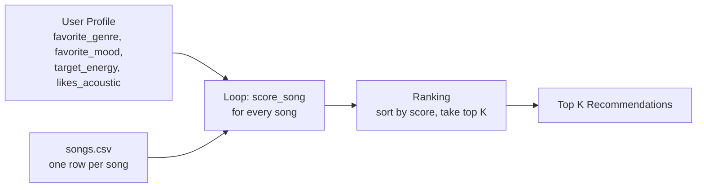

# 🎵 Music Recommender Simulation

## Project Summary

In this project you will build and explain a small music recommender system.

Your goal is to:

- Represent songs and a user "taste profile" as data
- Design a scoring rule that turns that data into recommendations
- Evaluate what your system gets right and wrong
- Reflect on how this mirrors real world AI recommenders

Replace this paragraph with your own summary of what your version does.

---

## How The System Works

Real-world recommenders (Spotify, YouTube, etc.) don't just look at one song at a
time. At scale they combine **content signals** (the actual properties of a song —
genre, tempo, energy) with **behavioral signals** (what millions of similar listeners
skipped, replayed, or added to playlists) and learn patterns automatically. My version
is a much smaller, transparent stand-in for the *content-based* half of that idea: it
compares the measurable properties of each song to a user's stated taste and scores how
well they match. It deliberately prioritizes the "vibe" of a song — how energetic and
how positive it feels, plus its genre and mood — over popularity or listening history,
because those are the features that a person can actually feel and describe.

### Features each `Song` uses

- `genre` — categorical anchor (pop, lofi, rock, jazz, ambient…)
- `mood` — categorical vibe label (happy, chill, intense, focused…)
- `energy` — numeric 0–1, how hyped vs. calm the song is
- `valence` — numeric 0–1, musical positivity / happiness

(The dataset also has `tempo_bpm`, `danceability`, and `acousticness`, which are good
candidates for later experiments.)

### What the `UserProfile` stores

The user's preferences, mirroring the song features so they can be compared directly:

- preferred `genre` (e.g. `"lofi"`)
- preferred `mood` (e.g. `"chill"`)
- preferred `energy` (a target value 0–1, e.g. `0.35`)
- preferred `valence` (a target value 0–1, e.g. `0.60`)

### How the `Recommender` scores a song (Scoring Rule)

For **categorical** features it awards points for an exact match. For **numeric**
features it rewards *closeness* to the user's target rather than "bigger is better":

```
feature_score = 1 - |song_value - user_preference|      # for energy, valence
```

Everything is combined with weights so some features matter more than others:

```
score = w_genre  · (genre matches?)
      + w_mood   · (mood matches?)
      + w_energy · (1 - |energy - pref_energy|)
      + w_valence· (1 - |valence - pref_valence|)
```

Genre is weighted highest, mood a bit lower, and the numeric features around 1.0 —
these weights are a knob to experiment with.

### How songs get chosen (Ranking Rule)

The Scoring Rule gives one number per song. The Ranking Rule then sorts **all** songs
by that score (highest first) and returns the top N. Both rules are needed: scoring
judges a single song, while ranking makes the comparative decision across the whole
catalog — which is what a recommendation actually is.

### Example `UserProfile`

```python
UserProfile(
    favorite_genre="lofi",
    favorite_mood="chill",
    target_energy=0.35,
    likes_acoustic=True,
)
```

Checked against the catalog, this profile clearly separates a match like *Midnight
Coding* (lofi, chill, energy 0.42, acousticness 0.71 → near-top score) from a mismatch
like *Broken Mirror* (metal, aggressive, energy 0.97, acousticness 0.05 → near-bottom
score). It does **not** distinguish well between two songs of the *same* genre with
different moods, since genre carries the most weight — a known limitation, not a bug.

### Finalized Algorithm Recipe

| Rule | Points |
|---|---|
| Genre match | `+2.0` |
| Mood match | `+1.5` |
| Energy similarity | `+1.0 × (1 - \|song.energy - target_energy\|)` |
| Acoustic bonus | `+0.5` if `likes_acoustic` is `True` and `song.acousticness > 0.6` |

Genre outweighs mood because it's the strongest "right bucket / wrong bucket" signal;
energy is a continuous reward rather than a flat bonus since it's a closeness measure;
the acoustic bonus is small and conditional since it only matters to some users.

### Data Flow



### Expected Biases

- **Genre dominance**: because genre is worth the most points, a song in the "right"
  genre but a mismatched mood can still outrank a song in the "wrong" genre with a
  perfect mood/energy match. The system may over-prioritize genre and miss great
  cross-genre matches.
- **Small, hand-picked catalog**: 18 songs across ~13 genres means most genres have
  only 1–2 songs, so results are heavily constrained by whatever happens to exist in
  the CSV rather than a true "best match."
- **No history/collaborative signal**: unlike real systems, this recommender has no
  idea what similar users liked — it can only compare stated preferences to song
  metadata, so it will keep recommending the same kind of song forever and can't
  surprise the user with something outside their stated taste.

---

## Getting Started

### Setup

1. Create a virtual environment (optional but recommended):

   ```bash
   python -m venv .venv
   source .venv/bin/activate      # Mac or Linux
   .venv\Scripts\activate         # Windows

2. Install dependencies

```bash
pip install -r requirements.txt
```

3. Run the app:

```bash
python -m src.main
```

### Running Tests

Run the starter tests with:

```bash
pytest
```

You can add more tests in `tests/test_recommender.py`.

---

## Sample Recommendation Output

Output of `python -m src.main` for the default profile (`genre=pop, mood=happy, energy=0.8`):

```
Loaded songs: 18

Top recommendations:

1. Sunrise City by Neon Echo - Score: 4.48
   Because: genre match (+2.0), mood match (+1.5), energy similarity (+0.98)

2. Gym Hero by Max Pulse - Score: 2.87
   Because: genre match (+2.0), energy similarity (+0.87)

3. Rooftop Lights by Indigo Parade - Score: 2.46
   Because: mood match (+1.5), energy similarity (+0.96)

4. Concrete Bloom by Kid Static - Score: 1.00
   Because: energy similarity (+1.00)

5. Night Drive Loop by Neon Echo - Score: 0.95
   Because: energy similarity (+0.95)
```

**Screenshot or video** *(optional)*: <!-- Insert a screenshot or demo video link here -->

---

## Experiments You Tried

**Weight shift: halved genre (2.0 → 1.0), doubled energy (1.0 → 2.0).**

For most profiles the #1 result didn't change — the winning song was usually strong
enough on genre+mood+energy together that halving genre alone didn't flip first
place. But the *order below #1* shifted noticeably. For "High-Energy Pop," *Rooftop
Lights* (genre mismatch, mood+energy match) jumped from #3 to #2, passing *Gym Hero*
(genre match only) — because a strong energy match started outweighing a lone genre
match. Same pattern in "Chill Lofi": *Spacewalk Thoughts* (mood+energy match, no
genre) passed *Focus Flow* (genre+energy match, no mood).

**Conclusion:** this made recommendations *more energy-driven and less genre-locked*,
not objectively "more accurate" — it depends entirely on whether you believe genre or
energy should dominate a listener's vibe. It confirmed the system is sensitive to
weight changes exactly where you'd expect: near-tied songs re-rank, while a clear
best-match song stays on top regardless. See [model_card.md](model_card.md) for the
full adversarial-profile evaluation and observed biases.

---

## Limitations and Risks

Summarize some limitations of your recommender.

Examples:

- It only works on a tiny catalog
- It does not understand lyrics or language
- It might over favor one genre or mood

You will go deeper on this in your model card.

---

## Reflection

Read and complete `model_card.md`:

[**Model Card**](model_card.md)

Write 1 to 2 paragraphs here about what you learned:

- about how recommenders turn data into predictions
- about where bias or unfairness could show up in systems like this


